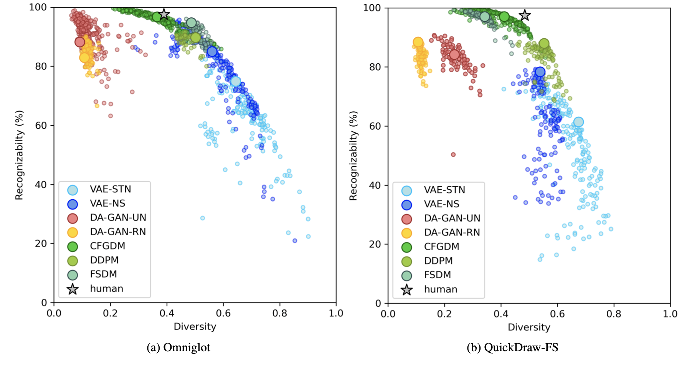
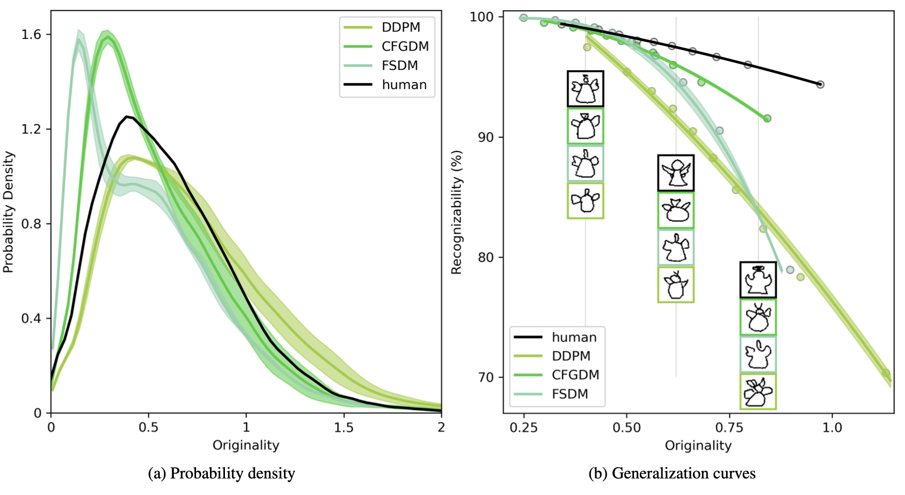
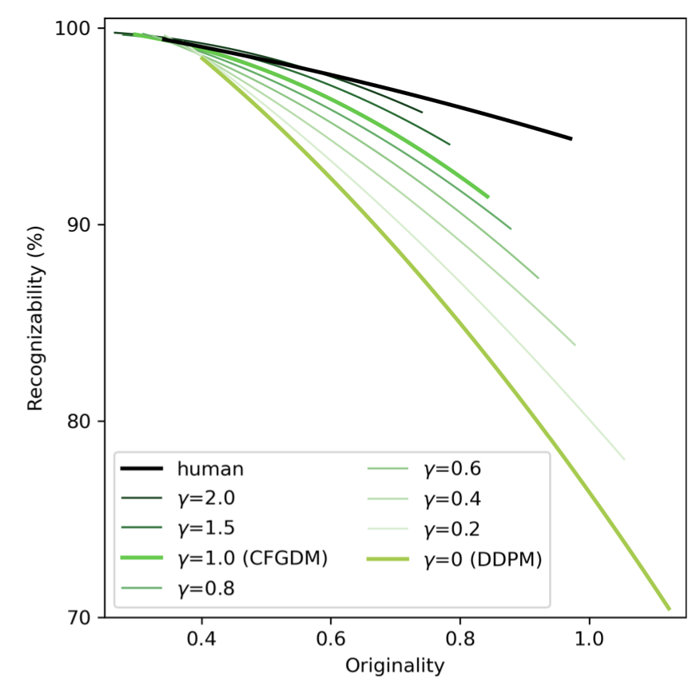
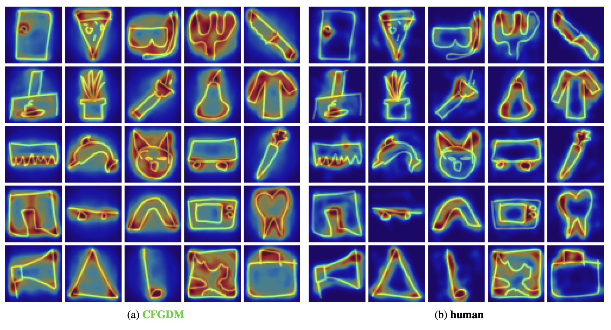

# Diffusion Models as Artists: Are we closing the Gap between Humans and Machines (Oral at ICML2023)?

Link to the article : https://arxiv.org/abs/2301.11722

## 1. Quick Summary 

In our article entitled "Diffusion Models as Artist: Are we closing the Gap between Humans and Machines ?", we compare humans and machines on a one-shot image generation task. To do so, we use and extend the "diversity vs. recognizability" framework [1] (see https://arxiv.org/abs/2205.10370), to include 3 types of diffusion model : the DDPM [2], the CFGDM [3] and the FSDM [4]. We use the Omniglot and QuickDraw dataset to compare the models with those presented in [1]. We observe that diffusion models produce sample that are easily recognizable and diverse in the same time (see figure on the Left).  

<br/>  
<br/>   
<br/>  

  

To deepen our analysis we introduce the generalization curves: it describes the evolution of the sample's recognizability as a function of their originality (see figure on the Right). We observe that the human generalization cruve is above all others, meaning that humans have the ability to produce recognizable, yet original samples. In addition, guiding the diffusion process using a classifier (as in the case of the CFGDM), tend to improve the sample recognizability at a cost of decreased originality. In contrary, the base diffusion network (the DDPM) suffers from a huge drop in recognizability as the samples become more originals.  

 

We confirm this phenomenon by varying the degree of guidance of the CFGDM. We observe that the higher the guidance scale ($\gamma$) the higher the sample's recognizability, but the narower the originality range. With high guidance scale ($\gamma=2$) the generalization curve of the CFGDM almost match the human generalization curve. However, in this case, the CFGDM only provide a local approximation, in low originality region, of the human generalization abilities. There is still a gap to be filled: models cannot produce original samples that are as recognizable as those produced by humans. 

<br/>  
  
To understand the difference in strategies between humans and machines, we study the diagnosticity of individual features for each category. We derive these features for human wthrought an online psychopgysic experiment called ClickMe-QuickDraw. For the diffusion model we draw inspiration from attribution methods to derive a score adapted to the diffusion models. The resulting importance map are shown on the Figure on the right. We observe that humans rely on fewer on more localized features than the diffusion model.

## 2. Train the one-shot diffusion models 
For the VAE-STN, the DAGAN and the VAS-NS, please refer to the following github repository : https://github.com/serre-lab/diversity_vs_recognizability

Prior to train any models, make sure to copy and unzip the datasets folder containing QuickDraw and Omniglot (available [here](https://drive.google.com/file/d/1opFXXV0yo6D--CtKo-NAgez3RyPtdFaE/view?usp=sharing)). In the following, we suppose your path to the unzip folder is called YOUR_DATA_PATH

### DDPM
To train the DDPM on Omniglot, run the following command line
```
python train_guided_diffusion.py --model_name ddpm --dataset_root YOUR_DATA_PATH --dataset omniglot --augment_class --timestep 500 --n_feat 48 --device cuda:6 
```

To run the DDPM, run the following command line
```
python train_guided_diffusion.py --model_name ddpm --dataset_root YOUR_DATA_PATH --dataset quickdraw_clust --augment_class --timestep 500 --n_feat 60 --device cuda:6 
```

#### CFGDM
To train the CFGDM on Omniglot, run the following command line
```
python train_guided_diffusion.py --model_name cfgdm --dataset_root YOUR_DATA_PATH  --dataset omniglot --augment_class --timestep 500 --n_feat 48 --device cuda:6 
```

To train the CFGDM on QuickDraw, run the following command line
```
python train_guided_diffusion.py --model_name cfgdm --dataset_root YOUR_DATA_PATH --dataset quickdraw_clust --augment_class --timestep 500 --n_feat 60 --device cuda:6 
```

## References
[1] : Boutin, Victor, et al. "Diversity vs. Recognizability: Human-like generalization in one-shot generative models." arXiv preprint arXiv:2205.10370 (2022).  
[2] : Ho, Jonathan, Ajay Jain, and Pieter Abbeel. "Denoising diffusion probabilistic models." Advances in Neural Information Processing Systems 33 (2020): 6840-6851.  
[3] : Ho, Jonathan, and Tim Salimans. "Classifier-free diffusion guidance." arXiv preprint arXiv:2207.12598 (2022).  
[4] : Giannone, Giorgio, Didrik Nielsen, and Ole Winther. "Few-shot diffusion models." arXiv preprint arXiv:2205.15463 (2022).  
